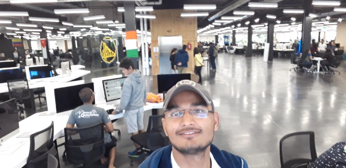

<!--StartFragment-->

Have you ever wondered about a school where there are no teachers, no principal, no syllabus, just only students? It may sound stupid but there exists a place called 42 Silicon Valley more popularly known as 42 Coding School. Where only the students come together and learn what they want to and they learn it by themselves. Amazingly, it is all for free. Here you will find all kind of students. From students who have just started their journey in programming to students who had written books on various aspects of programming.

<!--EndFragment--><!--StartFragment-->

Fortunately, I got a chance to visit this place under Student Startup Exposure Program. For those who don’t know what this program is, It is an initiative of the government of Rajasthan to send 100 student entrepreneurs to Silicon Valley, to provide them with the exposure to the global startup ecosystem. I was lucky enough to be selected for this program.

<!--EndFragment-->

<!--StartFragment-->

Our visit to 42 Silicon valley was planned for the 2nd day of the program. After a long ride, When we reached the place we were late. As we entered the building we were requested to assemble in the lobby area where one of the female staff is ready to introduce 42 silicon valley to us by a brief talk. She shared the vision of 42 silicon valley with us. 

As soon as briefing session ended we were free to roam inside the building to explore, however they formed small groups with 2 escorts (Senior students from 42 silicon valley) to understand what this place is all about. As we entered the main part of the building where students were working, I was amazed. I was surrounded by hundreds of MAC’s. I have not seen such a huge number of Apple device simultaneously. 

Controlling my excitement, I just continued exploring. Students around me were so focused on their work they were not even disturbed by our visit. There we explored robotics, mobile app development, virtual reality etc. Students of the startup zone of the building were also very enthusiastic to explain their product to us. Students were full of energy working on their own dreams. we had a great learning experience there.

 It is truly said,

> ## *“ When you are passionate enough to work on your dreams, then nothing can stop you from achieving it”*.

These people at 42 silicon valley are living example. They are simply learning and achieving their dreams.

<!--EndFragment-->
