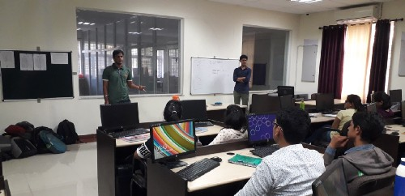

<!--StartFragment-->

From last many days I was having sleepless nights, just because in my deep heart I was feeling that I have not done anything of worth for the programming club of my college i.e. Techknights, RTU as a coordinator during last semester. So I decided to do something. But during the process of doing something, I got great learning and I finally decided to write about it. So that I can share this experience with you guys and here I am…

As I told you like I wanted to do something for the club so that I can experience deep satisfaction in my heart. So I started discovering different ideas, But it was not an easy task. I was just caught up in my mind to solve a number of questions like — What to do? When to do? After a little struggle with my mind, I finally decided to design the fundamental C programming course for the students, so that as a programming club we can help them in building a strong foundation of programming.

After choosing the idea, the next step comes of planning and that’s what I did. I jumped to my laptop and started planning for the course. I started my work by designing a course plan and then moved to team formation. After going through a lot of brainstorming and up’s and down’s of mind I successfully planned the course.

Now everything was ready. I was having an idea with a proper plan, the only step remaining was to execute the plan. Without wasting more time I started my work. I enthusiastically did all the paper works but only one final signature was remaining of Dean of our college. Unfortunately, when I visited Dean office nobody was there. I just told myself not to worry, hoping that I will get the permission surely. Next day I again visited Dean office and nothing changed. Again next day, I faced the same situation.

I can recall that moment when I was waiting outside the Dean office, I was completely frustrated. At the same moment, my mind was throwing some nonsense thoughts like I am a fool that I wasting my time in getting permission which doesn’t give something back. Ignoring all these thoughts I came back to my home.

That night my excitement was completely lost. Because you know what it’s very hard to face challenging situations. Only one thought was coming in my mind that whatever I have planned, will not work now. I was complaining about the situation. For some hours I decided to leave that topic and go to an evening walk.

That night when I was at my bed I started introspecting the situation that I came over in the morning and I realized that whatever I am facing at the moment is just a part of the process of bringing the change. Whatever we do in our daily life, whatever stage of life we are in, we will face such situations. Ultimately these are the situations which stand us apart from others. The phase of resistance comes in between the path of every goal and our success or failure is decided by the fact that we are going to face it or we will complain about it. I got a great lesson that night and I committed to myself that whatever it will take, I will try my best to get the permission for this course without losing self-control. With firm determination, I went to bed.

Next day I again visited Dean office and surprisingly I got the permission. I was extremely happy and satisfied within by the fact that now things will happen. I realized that feeling of happiness and satisfaction I was feeling at that moment was just because I faced resistance. If I have not faced that resistance I may not be feeling so happy after getting permission.

I started the course for the students at the club and I got a pretty good response.

<!--EndFragment-->

<!--StartFragment-->

I tried to explain each and every step of my thought process from choosing an idea of getting permission, just to tell you that it’s not an easy task to plan something and execute accordingly. It takes your time and efforts. And just putting effort will not grantee that you will be the hero of your story. You also need to be committed enough so that when the phase of resistance come in between your goal, you are able to overcome that. As someone rightly said-

> ## “We don’t grow when things are easy, we grow when we face challenges”

<!--EndFragment-->
