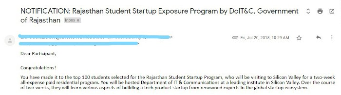
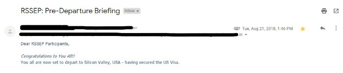

<!--StartFragment-->

Hello!

<!--EndFragment-->

<!--StartFragment-->

My name is Tushar Dave and I have recently visited Silicon Valley for an exposure trip.

In this blog post, I am going to convey how exactly I got an opportunity to visit Silicon Valley in the very first year of my college.

<!--EndFragment-->

<!--StartFragment-->

When I entered my freshman year of college like others, I was also a bit upset for not getting selected into IIT. But unlike others, I overcame that feeling in very early days of college. I stopped complaining about college and started searching for opportunities around me.

Soon I realized that my college is not as good as IIT’s but there are a lot of opportunities to work upon. I thought*God*sent me here, in this college, so that I can contribute to making our college a better place. With that kind of motivation, I started exploring around.

This is what I got.

Generally in our college, whenever a student asks a faculty about the study material, they just say one thing i.e. *ASK YOUR SENIORS* and at the same time, there was no way to contact seniors. Here, I saw an opportunity to help students to connect them with their seniors. I also deeply felt that there should be one platform where all the students of the college are able to make connections with each other.

I got the idea. The idea to make a mobile app which will connect all the students of the college. But to make a mobile app you should know how to make an app. This was again a new challenge.

At that time I knew only one programming language *i.e. C++( Thanks to CBSE )* but I didn’t have any clue how will I am going to make a mobile app which will connect college students. I just believed in myself and started my journey of Android development. It took me a while to figure out what to learn and from where to learn. But thanks to *Google Baba* who helped me at every stage of my learning.

I can recall the thoughts going on in my head during that phase like *am I ever be able to make this kind of app? I didn’t even know which software is used for android development how will I be able to make an app? I just know C++, It is not going to help me anywhere.* It was difficult to answer such questions at that time but now it is very clear to me that answer to none of these question matters. You just have to be curious, dedicated and disciplined to learn. Back to the timeline.

So after the struggle of learning android, I was finally able to make an app. The app was full of unknown bugs *(as I was not a software engineer)* but it was working pretty well according to my expectations. During this journey, many students around me joined this mission to connect college community. We named our app as *College Conexion*.

I started this whole journey to make an app around Sept. 2017 and we launched our app on google play store on 9th March 2018. After the launch, we were able to attract more than 700 users to our app. That was a good success for us.

And something unexpected happened.

I saw a message in the WhatsApp group of our college, there was one message stating that the “*Government of Rajasthan is planning to take 100 students to Silicon Valley for all expenses paid exposure trip”.*The government was looking for college students who did something interesting and have traits of becoming a future entrepreneur. Without wasting a second of time, I opened the portal and got to know about the trip which includes the visit to *Google HQ, Apple HQ, Intel HQ, NASA, Stanford University, UC Berkeley* and many places around the San Francisco. Such a great opportunity and how could I be able to leave that?

I went through the application and successfully applied for it. I was confident enough that we have done something interesting and we are definitely going to be selected.

As my confidence was based on what we did in the past it turned into reality.

I was selected among the 100 students who will be visiting Silicon Valley.

<!--EndFragment-->

<!--StartFragment-->

It was totally unexpected. I never dreamt of visiting Silicon Valley at such an early stage. But expectedly I was very excited and happy.

Coming from a rural backward area of Rajasthan and travelling to Silicon Valley was like a dream becoming true for me. When I told my parents that I am selected for exposure program and for that I will be visiting Silicon Valley, USA. For a moment, they didn’t believe me. Ultimately they believed and they were feeling so happy and proud of me.

Completing all VISA related work, and successfully getting a VISA. I got this mail-

<!--EndFragment-->

<!--StartFragment-->

I was super excited about the journey and that’s what kept me to explore the streets of Silicon Valley.

At last, I would just say

<!--EndFragment-->

<!--StartFragment-->

> ## “ Don’t work to get results, work to work, results will follow you ”

<!--EndFragment-->

<!--StartFragment-->

This is exactly what happened to me. I never thought that I will make an app and this app will help me to get selected for Silicon Valley trip. I just worked to help students. The results just followed me.

So keep your good work. One day you will get your results.

I would like to thank the Government of Rajasthan for giving us such a great opportunity to visit the dream place of every entrepreneur.

Need any help? Want to talk? Or just sent me wishes?

find me on [Facebook](https://facebook.com/davet.1998) | [Twitter](https://twitter.com/imtushardave) | [Linkedin](http://www.linkedin.com/in/imtushardave)

<!--EndFragment-->
