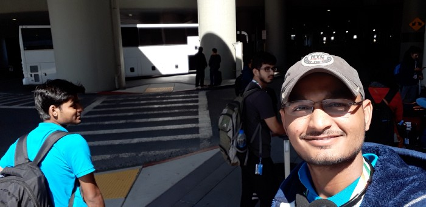
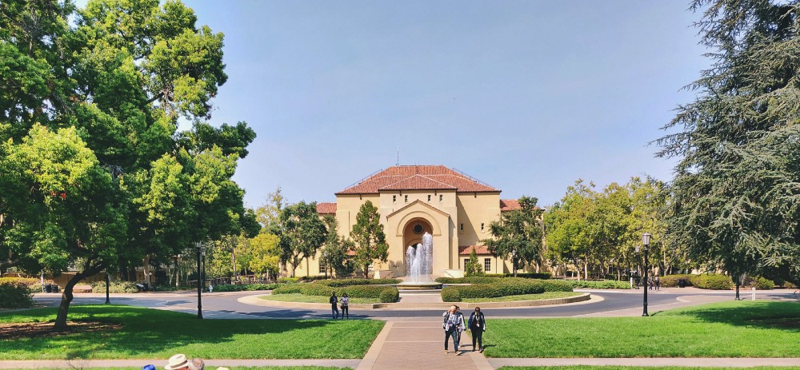

<!--StartFragment-->

Hello, My name is Tushar Dave and I have recently visited Silicon Valley for an exposure trip. In my previous story, I shared my journey, how I got selected for this all-expenses-paid exposure trip. In this blog post, I will try to share my experience of the trip to Silicon Valley.

<!--EndFragment-->

<!--StartFragment-->

I have compiled some clips from the trip to make a video which can help me recall my memories.

Do watch it, before jumping to the next section-

<!--EndFragment-->

<iframe width="560" height="315" src="https://www.youtube.com/embed/g7-rU8u02io" frameborder="0" allow="accelerometer; autoplay; encrypted-media; gyroscope; picture-in-picture" allowfullscreen></iframe>

<!--StartFragment-->

# The Trip

<!--EndFragment-->

<!--StartFragment-->

Our journey started from Jaipur, Rajasthan. We were heading towards Indira Gandhi International Airport, New Delhi.

This was the first time I was travelling outside the country so it was obvious that I was super excited. Our flight was like this: New Delhi to Shanghai to San Francisco. We had a connecting flight from Shanghai, China for the San Francisco.

*(I am skipping the travelling part because there was nothing happened in between other than sleep or Bahubali movie on the tablet screen during the complete 19 hrs journey)*

We arrived at San Francisco International Airport on the so-called same day*(We started the journey at 2:00 AM from New Delhi on 26th August 2018 and Reached San Francisco at 11:00 AM on 26th August 2018).*

The first click that I took was this -

<!--EndFragment-->

<!--StartFragment-->

We were full hungry as you know flight food is too good to eat. We all boarded into the bus and headed towards an Indian restaurant. After taking food, there was only one thing that was going into everyone’s head i.e. exploring streets around. And we all just started exploring the streets around the restaurant.

<!--EndFragment-->

<!--StartFragment-->

Soon we arrived at the hotel. I was superbly excited to see the hotel*(I have never been to such 5-star hotels).* Everything around me was different like culture, lifestyle, huge buildings, clean roads etc. For a moment I just couldn’t believe it that I was in the United States of America.

<!--EndFragment-->

<!--StartFragment-->

After all these wonderful experiences, we were ready for our actual work for which we were there. Next day we were asked to assemble in the hotel’s conference room for a briefing session. There we got a task to record our introduction video and here it is

<!--EndFragment-->

<iframe width="560" height="315" src="https://www.youtube.com/embed/8HB3-ARRaCw" frameborder="0" allow="accelerometer; autoplay; encrypted-media; gyroscope; picture-in-picture" allowfullscreen></iframe>

<!--StartFragment-->

### Day -1 | Stanford University

<!--EndFragment-->

<!--StartFragment-->

Our day started with a briefing session and soon we reached Stanford University and I realized that Stanford is not big it’s huge. Undoubtedly the campus is very beautiful. We got 5 hours to roam around the campus and explore. We explored every possible area, took hundreds of clicks and had great talks with students of Stanford.

I have written more about my visit to[ Stanford University here](https://medium.com/@imtushardave/stanford-university-visit-ssep-day-1-aefe1532ad68?source=friends_link&sk=6c800fc6b78149eb050e2f013fb20eb1).

<!--EndFragment-->

<!--StartFragment-->

### Day -2 | 42 Silicon Valley

<!--EndFragment-->

<!--StartFragment-->

Our visit to 42 Silicon Valley was scheduled for after lunch, so before lunch, we were working on the project like attending sessions, working on prototypes etc. 42 Silicon Valley is one of its kind place where students learn by themselves.

<!--EndFragment-->

<!--StartFragment-->

We had a great learning experience there. Meeting students who are working on a variety of projects from the field of AR, VR, Machine Learning, Artificial Intelligence etc was indeed a great exposure to us.

This day was also special because I had ***my birthday*** that day and the special thing is that I was celebrating it in the USA for the first time.

<!--EndFragment-->

<!--StartFragment-->

### Day -3 | Apple Park Visitor Center and Northeastern University

Our day started in a hurry as we were supposed to visit two places. We were excited as we are heading towards Apple park visitor centre. There was some restricted area so it was not possible for everyone to visit all places inside the campus but it was pretty clear that Apple HQ was big and surrounded by many trees.

<!--EndFragment-->

<!--StartFragment-->

After our visit to Apple park, we had a session at Northeastern University. We took lunch and arrived at Northeastern University. The session was very inspiring as the speaker was sharing how he started two ventures impacting education and health industry. Simply, we learnt a lot from there.

<!--EndFragment-->

<!--StartFragment-->

### Day -4 | Intel HeadQuarters(HQ) and Silicon Valley Bank

From the first microprocessor to world’s fastest Microprocessor, we saw it all here at Intel museum. We also got to know about how is the structure of a microprocessor, through a digital screen. On this day, some of the students were selected for pitching their idea at Silicon Valley Bank to get some valuable feedback from experts. For that, we visited Silicon Valley Bank and had some thoughtful and pitching session.

<!--EndFragment-->

<!--StartFragment-->

### Day-5 | NASA, Silicon Valley and Shopping Time

We visited NASA and had a wonderful experience. We also saw a model spaceship there. Soon we got free. So we all decided to spend some time shopping and that’s exactly what we did.\

<!--EndFragment-->

<!--StartFragment-->

### Day-6 | The guided tour of San Francisco

<!--EndFragment-->

<!--StartFragment-->

This day was our complete fun day. We just explored San Francisco on this day. We visited the highest point of the city, Had a cruise ride and enjoyed the bus ride in the city, Visited China Town for some shopping. That day I experienced the actual cold environment of SFO.

<!--EndFragment-->

<!--StartFragment-->

### Day-7 | Draper University and Techcode

<!--EndFragment-->

<!--StartFragment-->

Draper University was another cool place for entrepreneurs. Here we met Tim Draper (Early investor of Tesla Motors) and he shared some valuable learnings with all of us. He also gifted his newly launched book, The Startup Hero to us.

This day was also special because I was *selected* for pitching my idea at Techcode, which is a famous startup accelerator. I got the confidence of the next level after pitching in front of coordinator of Techcode. He taught us a lot of lessons there. That day was indeed one of the best days of this trip.

<!--EndFragment-->

<!--StartFragment-->

### Day-8 | Exploratorium and The Golden Gate Bridge

This day was again planned for exploring San Francisco. We visited Exploratorium which is like a science city, where we saw a variety of things which cannot be possible for me to share.

We also visited The Golden Gate Bridge, which is one of the famous bridges in the world.

<!--EndFragment-->

<!--StartFragment-->

### Day- 9 | University of California, Berkeley

Day-9 was fully reserved for our visit to the University of California, Berkeley. We had a Blockchain training workshop for the whole day.

<!--EndFragment-->

<!--StartFragment-->

### Day-10 | Google Cloud Visitor Center and Google HQ

Everyone was excited for this day. It was google day. We first Visited google cloud visitor centre where we had 3 sessions related to google assistant, Google products and Google developer community.

After completing sessions we headed towards Google Head Quarters in mountain view.

We clicked some pictures in the android park and came back to our hotel.

<!--EndFragment-->

<!--StartFragment-->

### Day-11 | Computer History Museum

<!--EndFragment-->

<!--StartFragment-->

### Day-12 | Madame Tussauds, San Francisco

<!--EndFragment-->

### Day-13 | Half Moon Bay Beach

<!--EndFragment-->

It was not possible for me to capture all the moment of laughter, joy and fun we experienced during the trip and it is not possible for me to share all those experiences and memories but I am pretty sure that this trip was a life-changing experience for me. The exposure I got to the culture, food, lifestyle and most importantly, technological advancements, are priceless.

<!--EndFragment--><!--StartFragment-->

> ## I know this was my first trip to Silicon Valley but I firmly believe it is not the last one.

<!--EndFragment-->

<!--StartFragment-->

Finally, I came back to India. At my home, Where I have to work for my home country.

At last, A big **Thank you** to the Government of Rajasthan for giving us a great opportunity.

- - -

Need any help? Want to talk? Or just sent me wishes?

find me on [Facebook](https://facebook.com/davet.1998) | [Twitter](https://twitter.com/imtushardave) | [Linkedin](http://www.linkedin.com/in/imtushardave)

<!--EndFragment-->
