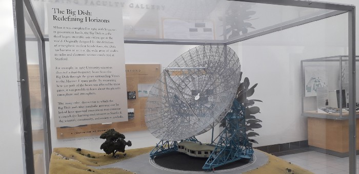

Just Imagine, you are invited to visit the place where you never thought off. That’s what happened to me. I never thought of being in the Stanford University, even I never thought that I will be visiting this place. But today I visited STANFORD UNIVERSITY. Yes, you read it right, Stanford University: The place where Google was born. This is happened because of Student Startup Exposure Program (An initiative of Government of Rajasthan to send students to Silicon Valley). SSEP team brought us here and told us to explore this place.

<!--StartFragment-->

I thought Stanford University is too big, it will not be possible for me to visit all the places in a short period of time. So I thought why not to search for some students and discuss with them about my startup and take some lessons from them. I liked this idea and did the same. Fortunately, near Packard building of Stanford University, I found some students. Initially, I was a little bit feared to talk to them, but this opportunity was rare, I encouraged myself and started walking towards them. I started my conversation by introducing myself, and then about my project and finally asking for suggestions. Fortunately, students, I was talking with, one of them was entrepreneur itself. She taught me great lessons about entrepreneurship. She also explained the environment for startups in Stanford, I discussed everything in depth as I was knowing that it is a lifetime opportunity to talk with students of Stanford. Discussion with that lady was full of knowledge so I recorded audio of that so that I can recall everything back. After talking to them, what I found is, they were very supportive, ready to help. My most of the time was spent in discussions. At last, I thought to explore some places and for that, I joined the company of some students who were also part of the exposure program. With them, we went to some Shriram Building that was of Bio-Technology Department. We went inside to see what is happening there and found some amazing labs where students are performing experiments and researches.

<!--EndFragment-->

<!--StartFragment-->

Exploring places and making some memories using pictures and videos, time passed. I went back to the point where we are asked to come. Recalling those experience again feels great. Stanford is really a great place to learn and explore. Whenever you come to Silicon Valley make sure to visit Stanford University and talk with intellectuals there.\
I will always be grateful for the government of Rajasthan, who provided me with such a great opportunity to visit Silicon Valley, It is really like a dream become true.

<!--EndFragment-->
